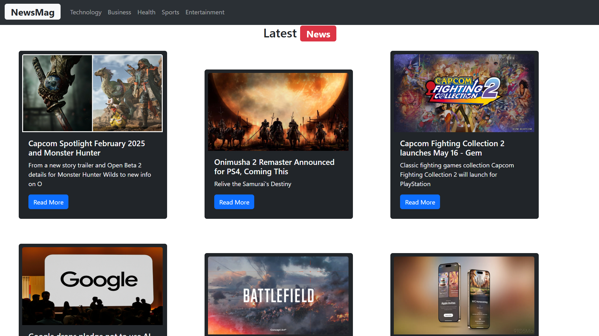

# 📰 News App

## 📌 Overview
A modern news application that fetches real-time news articles using the **News API**. Users can browse top headlines and filter news by category.

## 🚀 Features
- 🗞 **Top Headlines**: Displays trending news worldwide.  
- 📂 **Category Filtering**: View news by categories (General, Health, Technology, Sports, etc.).  

## 🛠️ Technologies Used
### **Frontend**
- ⚛ **React.js** (Component-based UI)
- 🎨 **TailwindCSS** (Modern and responsive styling)

### **API & Data Handling**
- 🌍 **News API** (Fetches real-time news articles)


## 🔧 Installation & Setup

1️⃣ **Clone the Repository**
```bash
git clone https://github.com/yourusername/news-app.git
```

2️⃣ Navigate to the Project Folder
```bash
cd news-app
```

3️⃣ Install Dependencies
```bash
npm install
```

4️⃣ Set Up API Key
Get a free API key from News API.
Create a .env file in the root directory and add:
```bash
REACT_APP_NEWS_API_KEY=your_api_key_here
```

5️⃣ Run the Project
npm run dev

## 📸 Screenshots

### 📰 General News  
|  |
|-----------------------------------|

### 🏥 Health Category  
|  |
|----------------------------------|

### 🔬 Technology Category  
|  |
|--------------------------------------------|

### ⚽ Sports Category  
|  |
|-----------------------------------|


⚡ Future Improvements
🌎 Multi-Language Support
📌 Save Favorite Articles
🎨 Dark Mode Toggle
🔍 Enhanced Search Functionality (More precise results and filtering)
📱 Improved Responsive Design (Better UI adaptation on different screen sizes)
